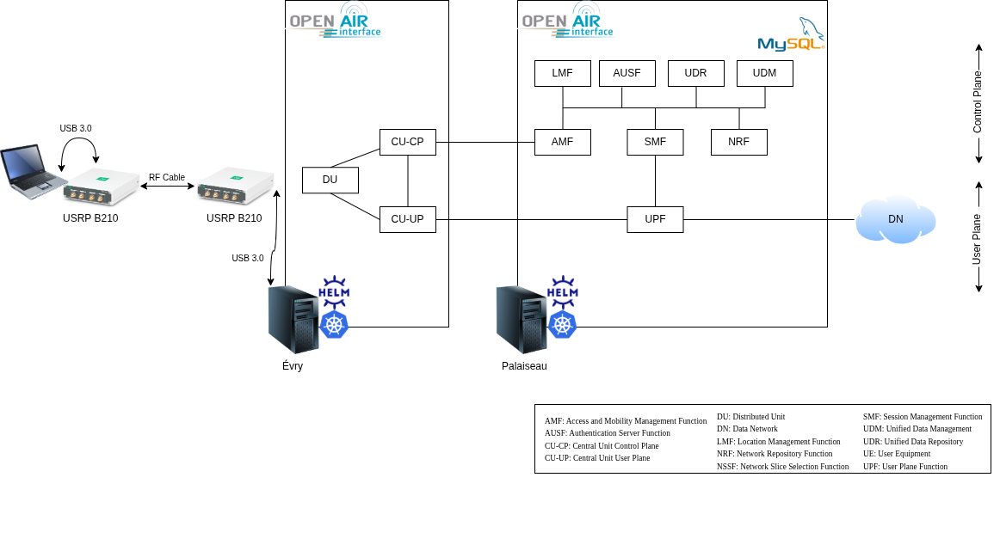
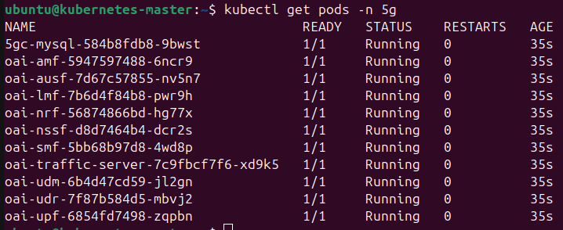
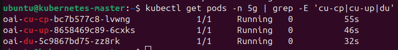
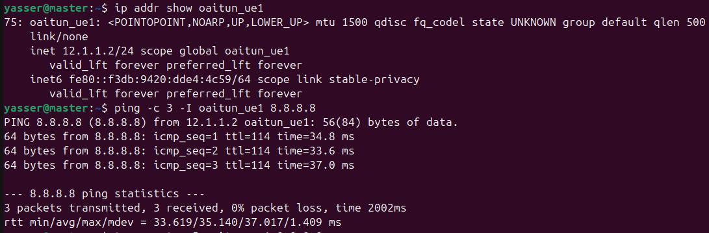

# OAI 5G SA on Kubernetes with USRP B210

## Overview

This repository provides an end-to-end OpenAirInterface 5G Standalone deployment on Kubernetes.

It includes the following components:

| Layer | Components |
|---|---|
| 5G Core | AMF, SMF, UPF, NRF, UDR, UDM, AUSF, MySQL |
| RAN | OAI disaggregated gNB: CU-CP, CU-UP, DU |
| UE | OAI NR-UE softmodem |
| Radio | USRP B210 |

The reference radio configuration used in this project is Band n78 with 24 PRB at 3604.8 MHz.

## Architecture

All network functions run as Kubernetes pods and are deployed with Helm charts.

The RAN uses the standard 3GPP gNB split model:

| Interface | Between | Protocol |
|---|---|---|
| F1-C | CU-CP and DU | F1AP over SCTP |
| F1-U | CU-UP and DU | GTP-U over UDP |
| E1 | CU-CP and CU-UP | E1AP over SCTP |
| N2 | CU-CP and AMF | NGAP over SCTP |
| N3 | CU-UP and UPF | GTP-U over UDP |

<div align="center">
    
</div>

## Demo Setup

The demo setup shown below is the left part of the architecture.

The RAN components run on a Kubernetes node in Evry. The gNB-side USRP B210 is connected to that node through USB 3.0. The UE-side USRP B210 is connected to a laptop through USB 3.0.

Both USRPs are connected with SMA coaxial cables for RF testing. In this setup, attenuators are used on the gNB side to keep the signal level safe and stable.

<div align="center">
    
</div>

## Radio Parameters

| Parameter | Value |
|---|---|
| Band | n78 |
| Duplex mode | TDD |
| DL center ARFCN | 640320 |
| Point A ARFCN | 640032 |
| Frequency | 3604.8 MHz |
| Numerology | 1 |
| Subcarrier spacing | 30 kHz |
| PRB | 24 |
| SSB offset | 24 |
| USRP | B210 |

## Prerequisites

Before deployment, make sure you have:

1. A working Kubernetes cluster.
2. Helm installed.
3. The Helm Spray plugin installed.
4. UHD installed on the machines connected to the USRPs.
5. A Kubernetes namespace for the deployment.

### Kubernetes Cluster

Cluster setup reference:

https://github.com/AIDY-F2N/k8s-cluster-setup-ubuntu24.git

### Helm

Helm installation guide:

https://helm.sh/docs/intro/install/

Install the Helm Spray plugin:

```bash
helm plugin install https://github.com/ThalesGroup/helm-spray
```

### Install UHD

Install UHD on the gNB host and on the UE machine:

```bash
sudo apt install -y autoconf automake build-essential ccache cmake cpufrequtils doxygen ethtool g++ git inetutils-tools libboost-all-dev libncurses-dev libusb-1.0-0 libusb-1.0-0-dev libusb-dev python3-dev python3-mako python3-numpy python3-requests python3-scipy python3-setuptools python3-ruamel.yaml

git clone https://github.com/EttusResearch/uhd.git ~/uhd
cd ~/uhd
git checkout v4.8.0.0
cd host
mkdir build
cd build
cmake ../
make -j $(nproc)
make test
sudo make install
sudo ldconfig
sudo uhd_images_downloader
```

### Namespace and Repository

Create the namespace:

```bash
kubectl create namespace 5g
```

Clone this repository:

```bash
git clone https://github.com/Yasser-Brh/oai-5g-usrp-k8s
cd oai-5g-usrp-k8s
```

If you have a single-node cluster, or if you want to deploy specific network functions on specific nodes without relying on the scheduler:

```bash
kubectl get nodes
```

Get the name of the node where you want to deploy your network function, then modify the values.yaml file in each Helm chart of the corresponding function and set:
```bash
nodeName: NODE_NAME
```
For the MySQL chart only, use instead:
```bash
nodeSelector:
  kubernetes.io/hostname: worker
```

## Deploy the 5G Core

Update chart dependencies and deploy the core:

```bash
helm dependency update 5g_core/oai-5g-advance/
helm install 5gc 5g_core/oai-5g-advance/ -n 5g
```

Check that the core pods are running:

```bash
kubectl get pods -n 5g
```

<div align="center">
    
</div>

## Deploy the RAN

Deploy the RAN components one by one:

```bash
helm install cucp 5g_ran/oai-cu-cp/ -n 5g
helm install cuup 5g_ran/oai-cu-up/ -n 5g
```

Before deploying the DU:

1. Connect the USRP B210 to the Kubernetes node that will run the DU.
2. If needed, set `nodeName` in `5g_ran/oai-du/values.yaml` to pin the DU pod to the correct node.
3. Update the B210 serial number in `5g_ran/oai-du/templates/configmap.yaml`.

```bash
helm install du 5g_ran/oai-du/ -n 5g
```

Check that all RAN pods are running:

```bash
kubectl get pods -n 5g | grep -E 'cu-cp|cu-up|du'
```

<div align="center">
    
</div>

## Build and Run the UE

For legal and safe lab testing, use coaxial RF cables and attenuators instead of over-the-air transmission.

In the reference setup, the gNB-side B210 and the UE-side B210 are connected through SMA coaxial cables.

### Build OAI for the UE

```bash
git clone https://gitlab.eurecom.fr/oai/openairinterface5g.git ~/openairinterface5g
cd ~/openairinterface5g
git checkout develop

cd cmake_targets
./build_oai -I
./build_oai -w USRP --ninja --nrUE -C
```

### Run the NR-UE

Update the `ue.conf` file:
```bash
nano openairinterface5g/targets/PROJECTS/GENERIC-NR-5GC/CONF/ue.conf 
```
Then set the following parameters:

```bash
uicc0 = {
  imsi = "208950000000031";
  key = "0C0A34601D4F07677303652C0462535B";
  opc = "63bfa50ee6523365ff14c1f45f88737d";
  dnn = "oai";
  nssai_sst = 1;
}
```
Connect the second USRP B210 to the UE laptop with USB 3.0, then start the UE:

```bash
cd openairinterface5g/cmake_targets/ran_build/build
sudo ./nr-uesoftmodem -C 3604800000 -r 24 --numerology 1 --ssb 24 --ue-fo-compensation -O ../../../targets/PROJECTS/GENERIC-NR-5GC/CONF/ue.conf --log_config.global_log_options level,nocolor,time
```

## Basic Test

Check that the UE tunnel interface exists:

```bash
ip addr show oaitun_ue1
```

Test connectivity through the UE tunnel:

```bash
ping -c 3 -I oaitun_ue1 8.8.8.8
```

<div align="center">
    
</div>

## Known Limitation

### Two B210 devices are not synchronized

If both the gNB and the UE use separate USRP B210 devices, each one relies on its own internal oscillator. Over time, clock drift may appear and cause:

- PBCH decoding errors
- Radio link failure
- Loss of the UE tunnel IP address

The recommended solution is to use an external shared clock source such as an Ettus OctoClock-G.

Reference:

https://kb.ettus.com/5G_OAI_End-to-End_Reference_Architecture_with_USRP

Without an external reference clock, short test sessions may still work, but long-term stability is not guaranteed.
